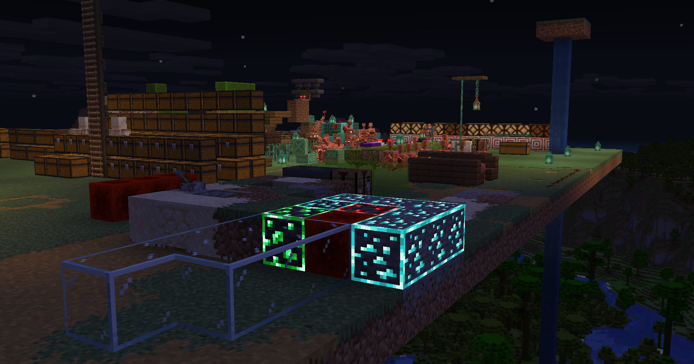

# Continuity

Continuity is a Minecraft mod that allows resource packs that use the OptiFine connected textures format, OptiFine emissive textures format (only for blocks and item models), or OptiFine custom block layers format to work without OptiFine.

Continuity is client-side only and includes two built-in resource packs. The Default Connected Textures pack provides connected textures for glass, sandstone, and bookshelves, similar to the built-in connected textures provided by OptiFine. The Glass Pane Culling Fix pack culls faces between vertically stacked glass panes to make them look seamless with connected textures.

Formally, Continuity implements the Continuity connected textures specification, Continuity emissive textures specification, and Continuity custom block layers specification. All of these are extensions of the corresponding OptiFine specification and were created to provide more features to resource pack authors. The documentation for the Continuity specifications can be found at the [Continuity wiki](https://github.com/PepperCode1/Continuity/wiki).

Continuity is developed as a Fabric mod and is recommended to be used with Fabric. However, [Connector](https://github.com/Sinytra/Connector) and [Forgified Fabric API](https://github.com/Sinytra/ForgifiedFabricAPI) allow Continuity to work well on other mod loaders such as NeoForge and Forge. Releases are made on CurseForge and Modrinth that are marked as working with these mod loaders; these releases contain the same code as equivalent releases for Fabric, but with additional metadata to declare Connector and Forgified Fabric API as dependencies. An official NeoForge version of Continuity that does not require Forgified Fabric API is not planned at this time due to major technical differences between the Fabric and NeoForge APIs.

### Links

[CurseForge Page](https://www.curseforge.com/minecraft/mc-mods/continuity) \
[Modrinth Page](https://modrinth.com/mod/continuity) \
[Wiki](https://github.com/PepperCode1/Continuity/wiki) \
[Discord](https://discord.gg/7rnTYXu)

---

## 🔧 Development & Maintenance

### Minecraft 1.21.10 Upgrade - Complete ✅



This project completed a comprehensive upgrade from Minecraft 1.21.6 to 1.21.10 using AI-assisted development. This was the **third major AI development iteration**, extensively documented to maintain consistency across multiple AI models working on the codebase.

#### Build Commands
```powershell
# Build current version (1.21.10)
.\gradlew clean build

# Current configuration
# - Minecraft: 1.21.10
# - Fabric API: 0.138.0
# - Java: 21 (LTS - stable, no preview features)
```

#### Documentation Index

**Core Architecture** (start here):
- **[.github/copilot-instructions.md](.github/copilot-instructions.md)** - Complete architecture overview, three-layer design, API flows, extension points

**Upgrade Documentation** (in `.docs/` directory):
- **UPGRADE_STRATEGY.md** - Strategic decisions, risk categories, phase breakdown (Phases 1-9 documented)
- **ANALYSIS_REPORT.md** - File-by-file analysis of all 93 Java files with risk prioritization
- **CRITICAL_FILES_GUIDE.md** - Detailed implementation tasks for 6 critical files
- **PHASE2_API_RESEARCH.md** - API research findings, breakthrough discoveries
- **PHASE2B_IMPLEMENTATION_STRATEGY.md** - Final implementation approach (37% simpler than initial strategy)
- **PHASE3_COMPLETION_REPORT.md** - Build successful, code changes summary (+172/-202 lines)
- **PHASE3_API_COMPATIBILITY_ISSUES.md** - API fixes applied during Phase 3
- **PHASE4_RUNTIME_ERROR.md** - Runtime issues discovered and solutions
- **PHASE7_COMPLETION_REPORT.md** - CTM initial load fix (synchronized loading fallback)
- **PHASE8_TASK_SPECIFICATIONS.md** - Emissive texture rendering fixes

**Changelog** (in `.github/changelog/`):
- Individual markdown files documenting all code changes per version/phase

#### Key Achievements
- ✅ **Build Status**: SUCCESSFUL (cleaned, verified, JAR generated)
- ✅ **Java 21**: Stable production target (LTS, no Java 23+ features)
- ✅ **Phases Complete**: 1-8 documented and implemented
- ✅ **File Architecture**: 2 files deleted, 15+ files modified, multiple new files created
- ✅ **Code Quality**: Net -30 lines (37% architectural simplification)
- ✅ **Mixin Safety**: Verified mixin rules (private static methods in mixins)

#### AI Development Notes

> **This was the third attempt at this project.** Given the complexity of the codebase and the need for multiple AI models to maintain consistency, extensive documentation was created upfront. This documentation proved essential—while some documents contained redundant or speculative content that subsequent models didn't fully review (a common pattern in AI-assisted development), the structured approach ensured that even with this inefficiency, the work could proceed coherently. Three iterations through GitHub Copilot Pro consumed **87% of the monthly token budget**, but enabled complete delivery of the upgrade with strong coordination and clear documentation of the system internals.


