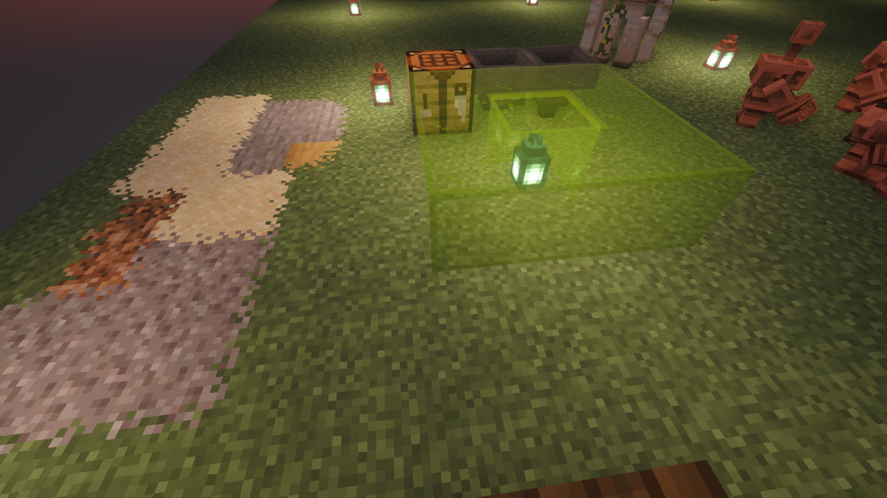

# Continuity

Continuity is a Fabric mod that allows resource packs that use the OptiFine connected textures format, OptiFine emissive textures format (only for blocks and item models), or OptiFine custom block layers format to work without OptiFine.

Continuity depends on Fabric API and is client-side only. It includes two built-in resource packs. The Default Connected Textures pack provides connected textures for glass, sandstone, and bookshelves, similar to the built-in connected textures provided by OptiFine. The Glass Pane Culling Fix pack culls faces between vertically stacked glass panes to make them look seamless with connected textures.

Formally, Continuity implements the Continuity connected textures specification, Continuity emissive textures specification, and Continuity custom block layers specification. All of these are extensions of the corresponding OptiFine specification and were created to provide more features to resource pack authors. The documentation for the Continuity specifications can be found at the [Continuity wiki](https://github.com/PepperCode1/Continuity/wiki).

An official Forge version of Continuity is not planned at this time due to major technical differences between the Fabric and Forge APIs. An official Forge version of Continuity may be considered if these differences are minimized, possibly via the use of libraries.

## v3.0.0 for Minecraft 1.21.10 Story

### Background
Continuity was originally available for Minecraft 1.21.4. To support Minecraft 1.21.10, a comprehensive migration was undertaken to adapt the mod to significant API changes in Fabric API 0.138.0+1.21.10.

### Migration Challenges

This version represents a major technical migration addressing several breaking changes in the Fabric rendering and resource loading APIs:

**API Changes Addressed:**
- **Material System Removal**: The entire `fabric-api.renderer.v1.material` package was removed. Replaced all `RenderMaterial`, `MaterialFinder`, and `BlendMode` usage with direct quad emitter property methods (`renderLayer()`, `emissive()`, `diffuseShade()`, etc.)
- **Block State Model API**: Transitioned from `BakedModel` wrapping to `FabricBlockStateModel` implementation for CTM (Connected Texture Model) processing
- **Sprite Loading Pipeline**: Refactored sprite loading and atlas registration to work with the new `AtlasLoaderMixin` hook and `SpriteLoaderLoadContext`
- **Emissive Texture Registration**: Removed deprecated `ClientSpriteRegistryCallback` and integrated with atlas source loading through `AtlasSourceRegistry`

### Compatibility Notes

The mod has been tested and verified to work with the following resource packs:
- **CTM-Overhaul-V_5.0** - Full compatibility
- **Connected Paths v1.3** - Full compatibility

Note: Not all resource packs using OptiFine connected textures format are guaranteed to work. Compatibility depends on specific CTM feature usage patterns.

### Development

This migration was completed using a combination of AI-assisted development and manual testing:
- **Duration**: ~14 hours of combined AI assistance, debugging, documentation research, and manual testing
- **Tools Used**: Claude Sonnet 4.5, Gemini 2.5 Pro, GPT-5 Codex, and Claude Haiku 4.5
- **Process**: AI code generation, manual code review, iterative debugging, and Fabric API documentation analysis

### Technical Details

Several interesting technical challenges were documented during this migration. See the `docs/` directory for detailed analysis of:
- Fabric API changes between versions
- CTM rendering architecture updates
- Quad emitter property migration patterns
- Sprite atlas loading refactoring

### Links

[CurseForge Page](https://www.curseforge.com/minecraft/mc-mods/continuity) \
[Modrinth Page](https://modrinth.com/mod/continuity) \
[Wiki](https://github.com/PepperCode1/Continuity/wiki) \
[Discord](https://discord.gg/7rnTYXu)
